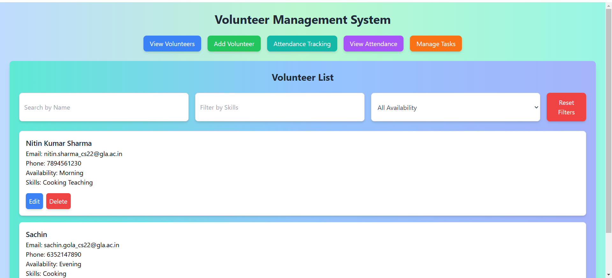
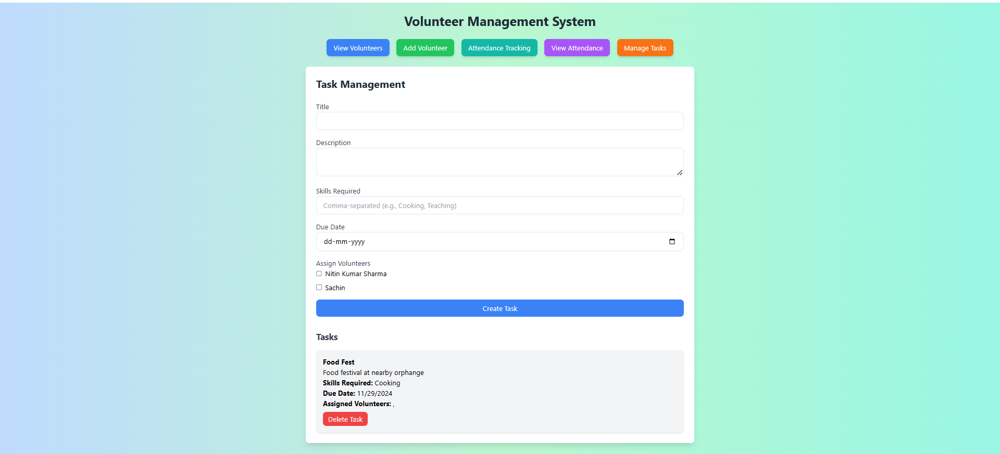

# Volunteer Management System 🌟  
  
  
  

A comprehensive solution to manage volunteers, tasks, attendance, and events effectively. This system is designed for organizations, events, and non-profits to seamlessly track volunteer activities, assign tasks, and monitor attendance in real-time.

---

## Features 🚀

- **Volunteer Registration & Management**: Allows volunteers to sign up, manage their profiles, and track their activity.
- **Task Assignment**: Easily assign tasks to volunteers and track their completion status.
- **Attendance Tracking**: Automatically log volunteer attendance for events, shifts, and tasks.
- **Event Management**: Manage and organize events where volunteers can participate. This includes:
  - Creating, updating, and deleting events.
  - Assigning volunteers to events.
  - Viewing event details such as date, time, and assigned volunteers.
  - CRUD operations for events to ensure smooth event management.
- **CRUD Application**: The system is designed to be a **CRUD** (Create, Read, Update, Delete) application, ensuring full flexibility in managing the volunteer system.

---

## UI Preview 📱

### Volunteer List

### Event Management Interface

> *Note: Screenshots showcase the clean, user-friendly interface with responsive design using Tailwind CSS.*

---

## Technologies Used 💻

- **Frontend**:  
  - HTML, CSS, JavaScript  
  - **React.js** (for dynamic, interactive UI)  
  - **Tailwind CSS** (for responsive and customizable design)

- **Backend**:  
  - **Node.js**  
  - **Express.js** (RESTful API for handling requests)

- **Database**:  
  - **MongoDB** (for storing volunteer profiles, tasks, attendance logs, and events)

- **Version Control**:  
  - Git, GitHub (for collaboration and version tracking)

---

## Installation Guide ⚙️

### Prerequisites

Before you begin, ensure you have the following installed:

- [Node.js](https://nodejs.org/) (v14 or above)  
- [MongoDB](https://www.mongodb.com/) (for local development)  
- [Git](https://git-scm.com/) (for cloning the repository)

---

### Step-by-Step Setup
1. Clone the Repository 
   Open your terminal and run the following commands: 

   git clone https://github.com/Rishabh310504/Volunteer-Management-System.git 
   cd Volunteer-Management-System 

2. Install Dependencies 
   npm install
   
3. Set Up Environment Variables: 
   MONGO_URI=mongodb://localhost:27017/volunteer_management 
   PORT=5000 
   
4. Start the Server: 
   Step 1. Install MongoDB and MongoDB Compass 
   Step 2. Create new connection  
   Step 3. Create a New Database in MongoDB Compass  
   Step 4. Test the Connection  
   &nbsp;&nbsp;cd backend 
   &nbsp;&nbsp;node server.js 
   
5. Start the Application: 
   cd frontend 
   npm start     
  
